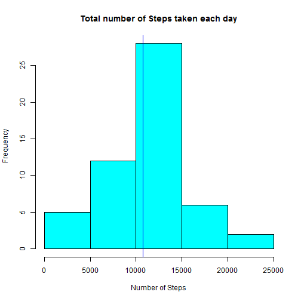
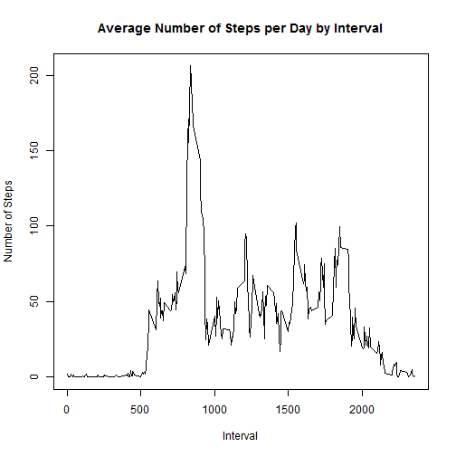
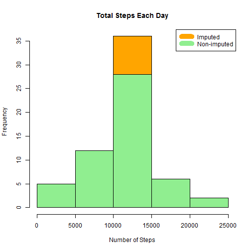
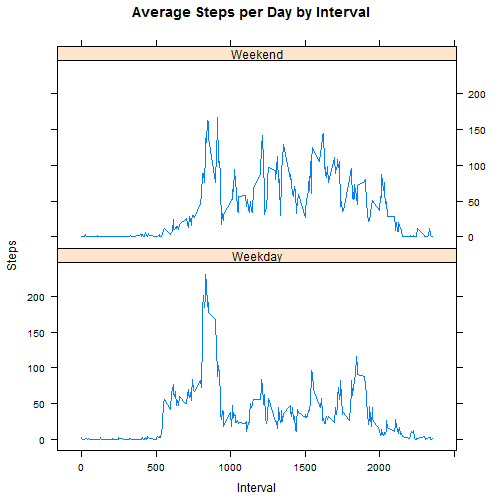

# Reproducible Research - Peer Assessment 1 
# December, 2014

## About


### This report is prepared as a deliverable in Reproducible Research Course to answer a series of questions using data collected from a personal acitivity monitoring device .


 The goals of this project are : 

 * **loading and preprocessing data**
 * **imputing missing values**
 * **interpreting data to answer research questions**

## Data
The data for this assignment was downloaded from the course web
site:

* Dataset: [Activity monitoring data](https://d396qusza40orc.cloudfront.net/repdata%2Fdata%2Factivity.zip) [52K]

The variables included in this dataset are:

* **steps**: Number of steps taking in a 5-minute interval (missing
    values are coded as `NA`)

* **date**: The date on which the measurement was taken in YYYY-MM-DD
    format

* **interval**: Identifier for the 5-minute interval in which
    measurement was taken

The dataset is stored in a comma-separated-value (CSV) file and there are a total of 17,568 observations in this dataset.

### ======================================================================


## Loading and preprocessing the data

#### Check if the data file exists, else  download , unzip and copy into a data frame called activitydata. 


```r
if(!file.exists("activity.csv")) {
        temp <- tempfile()
        download.file("http://d396qusza40orc.cloudfront.net/repdata%2Fdata%2Factivity.zip",temp)
        unzip(temp)
        unlink(temp)
}

activitydata <- read.csv("activity.csv")
str(activitydata)
```

```
## 'data.frame':	17568 obs. of  3 variables:
##  $ steps   : int  NA NA NA NA NA NA NA NA NA NA ...
##  $ date    : Factor w/ 61 levels "2012-10-01","2012-10-02",..: 1 1 1 1 1 1 1 1 1 1 ...
##  $ interval: int  0 5 10 15 20 25 30 35 40 45 ...
```

```r
head(activitydata)
```

```
##   steps       date interval
## 1    NA 2012-10-01        0
## 2    NA 2012-10-01        5
## 3    NA 2012-10-01       10
## 4    NA 2012-10-01       15
## 5    NA 2012-10-01       20
## 6    NA 2012-10-01       25
```

### ======================================================================

## What is mean total number of steps taken per day?

#### To caluclate the mean we are ignoring the missing values in the data set. The total number of steps taken each day is being shown via a histogram. The mean and the median are calculated. 


```r
steps_by_day <- aggregate(steps ~ date, activitydata, sum,na.rm=TRUE)
hist(steps_by_day$steps, main = paste("Total number of Steps taken each day"), col="cyan", xlab="Number of Steps")
rmean <- mean(steps_by_day$steps)
rmedian <- median(steps_by_day$steps)
abline(v=rmean, col = "red")
abline(v=rmedian, col = "blue")
```

 

#### The `mean` is 1.0766189 &times; 10<sup>4</sup> and the `median` is 10765.


### ======================================================================

## What is the average daily activity pattern?


* Compute average steps for each interval for all days. 
* Make a  time series plot (type ="l") of the 5-min interval (x-axis ) and  Average Number Steps taken, averaged across all days (y-axis) 
* Find interval with most average steps. 

```r
steps_by_interval <- aggregate(steps ~ interval, activitydata, mean)

plot(steps_by_interval$interval,steps_by_interval$steps, type="l", xlab="Interval", ylab="Number of Steps",main="Average Number of Steps per Day by Interval")
```

 

```r
max_interval <- steps_by_interval[which.max(steps_by_interval$steps),1]
```

#### The 5-minute interval, on average across all the days in the activitydata set, containing the maximum number of steps is 835.


### ======================================================================

## Impute missing values. 

1: Calculate and report the total number of missing values in the dataset (i.e. the total number of rows with NAs)

#### The total number of rows with NAs is 2304

2 & 3 : Missing data needed to be imputed. A simple approach for filling in all of the missing values is being used here. The average for each interval is being used in place of NA or missing values.  


```r
imputed_data <- transform(activitydata, steps = ifelse(is.na(activitydata$steps), steps_by_interval$steps[match(activitydata$interval, steps_by_interval$interval)], activitydata$steps))
```

4.  Create a Histogram of the total number of steps taken each day.  

```r
steps_by_day_i <- aggregate(steps ~ date, imputed_data, sum)
hist(steps_by_day_i$steps, main = paste("Total Steps Each Day"), col="orange", xlab="Number of Steps")

#Create Histogram to show difference. 
hist(steps_by_day$steps, main = paste("Total Steps Each Day"), col="light green", xlab="Number of Steps", add=T)
legend("topright", c("Imputed", "Non-imputed"), col=c("orange", "light green"), lwd=10)
```

 

Calculate new mean and median for imputed data. 

```r
rmean.i <- mean(steps_by_day_i$steps)
rmedian.i <- median(steps_by_day_i$steps)
```

Calculate difference between imputed and non-imputed data.

```r
mean_diff <- rmean.i - rmean
med_diff <- rmedian.i - rmedian
```

Calculate total difference.

```r
total_diff <- sum(steps_by_day_i$steps) - sum(steps_by_day$steps)
```

#### * The imputed data mean is 1.0766189 &times; 10<sup>4</sup>
#### * The imputed data median is 1.0766189 &times; 10<sup>4</sup>
#### * The difference between the non-imputed mean and imputed mean is 0
#### * The difference between the non-imputed median and imputed median is 1.1886792
#### * The difference between total number of steps between imputed and non-imputed data is 8.6129509 &times; 10<sup>4</sup>. 

### The mean ( imputed and non-imputed ) are the same, however, there were 86129 more steps in the imputed data.

### ======================================================================

## Are there differences in activity patterns between weekdays and weekends?

A Panel Plot containing a time-series plot  of the 5-minute interval (x-axis) and the average of number of steps taken, averaged across all days of the week or weekends is shown here : 

### The weekends show more activity in general while the initial part of the weekday has increased activity tapering down and remaining low towards the later part. 


```r
weekdays <- c("Monday", "Tuesday", "Wednesday", "Thursday", "Friday")

imputed_data$dow = as.factor(ifelse(is.element(weekdays(as.Date(imputed_data$date)),weekdays), "Weekday", "Weekend"))

steps_by_interval_i <- aggregate(steps ~ interval + dow, imputed_data, mean)

library(lattice)

xyplot(steps_by_interval_i$steps ~ steps_by_interval_i$interval|steps_by_interval_i$dow, main="Average Steps per Day by Interval",xlab="Interval", ylab="Steps",layout=c(1,2), type="l")
```

 
